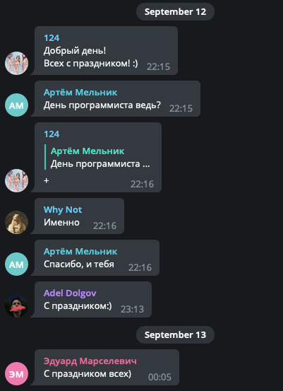

Домашнее задание по лекции "RecyclerView"
======

#### Реализовать отображение списка постов с помощью RecyclerView.

1. В **Activity** должен отображаться список постов в **RecyclerView**. Должны быть разные **ViewHolder**'ы для разных типов постов. Необходимо разделить текущую кастомную вьюгруппу на две части: одна только с текстом, другая - с текстом и картинкой. На этапе маппинга необходимо определять, содержит ли пост картинку, и, в зависимости от этого, создавать ту или иную вьюху.

1. Реализовать фукнционал _pull to refresh_. В этом случае данные в списке должны быть обновлены. Необходимо использовать **DiffUtil**. Добавление, удаление и перемещение элементов должно происходить анимированно. Скрытый пост должен оставаться скрытым до перезапуска приложения.

1. Реализовать функционал управления жестами. Свайп _справа налево_ должен скрывать пост; свайп _слева направо_ - ставить посту лайк.

1. Добавить разделители между постами с помощью **RecyclerView.ItemDecoration**. Разделители должны быть между постами с разными датами. Разделитель должен содержать текст: _"Сегодня"_, _"Вчера"_ или, если пост опубликован ранее, дату в формате _"dd-MMMM-YYYY"_. Между постами с совпадающими датами должен быть отступ.

5. Использовать сторонние библиотеки не допускается.